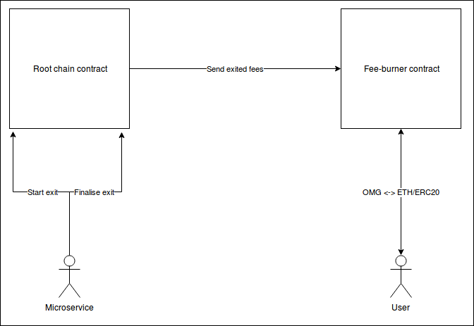

# Architecture

This is a description of fee-burner's design.

## Overview

## Modules
The whole system consists of 3 products:
- 2 Ethereum contracts (root chain contract and fee-burner contract), one depends on the other;
- a microservice written in `Elixir`;

### Root chain contract 
This contract is taken from `plasma-contracts` (`root chain contract`), but some modifications will be necessary.
The main modification enables the operator to exit fees, but enforces those exits to be sent to the `fee-burner` contract.

### Fee-burner contract
This is a completely new contract. This contract receives fees and provides an automated marketplace that allows people to send `OMGs` and get the fee-tokens in return. The operator is allowed to set exchange rates at it's sole discretion. `OMGs` sent to this contract get burnt.

### Microservice
The microservice is responsible for periodically starting fees' exits and finalising those that got through the challenge period. 

#### Beginning fee exit

From time to time, the microservice should start fees' exit, having previously computed the amount of fees eligible to exit. 
Beginning fee exit is as simple as calling proper method on the root chain contract with specified token and amount as call arguments.

#### Finalising fee exit

After a challenge period, the exit fee should be sent directly to the `fee-burner` - the microservice should initialise such a transaction. 

## Interfaces

### Root chain contract
Two new public methods will be implemented in the root chain contract. One will be responsible for starting fee exit and the other one for finalising fee exit. Both method can be invoked by the operator only.

### Fee-burner contract
Fee-burner will provide the following interface:
- check exchange rate of a token;
- set exchange rate (*only operator*);
- exchange tokens;
- exchange `OMG`s for `ETH`;
- receive `ETH` deposit.

### Microservice

The microservice will work on behalf of the operator and will use public interface of both contracts, mainly only those which usage is restricted to the operator only.
Microservice can use `watcher` or `state` in order to compute the fees available to exit.

#### Modules and their responsibilities
- `Burner` - API of the microservice;
- `State` - its responsibility is to store accumulated fees and keep track of transactions sent, but not already mined. 
_In the future should be changed into a persistent version._ 
- `ThresholdAgent` - runs in the background and from time to time based on online date checks whether any fees has met the threshold, 
in that case it starts an exit automatically (through the Burner module).
- `Eth` - module takes responsibility for sending transactions as well as checking whether they did execute successfully or not.
- `HTTPRequester` - this module is responsible for retrieving gas and token prices from external servers.
 
